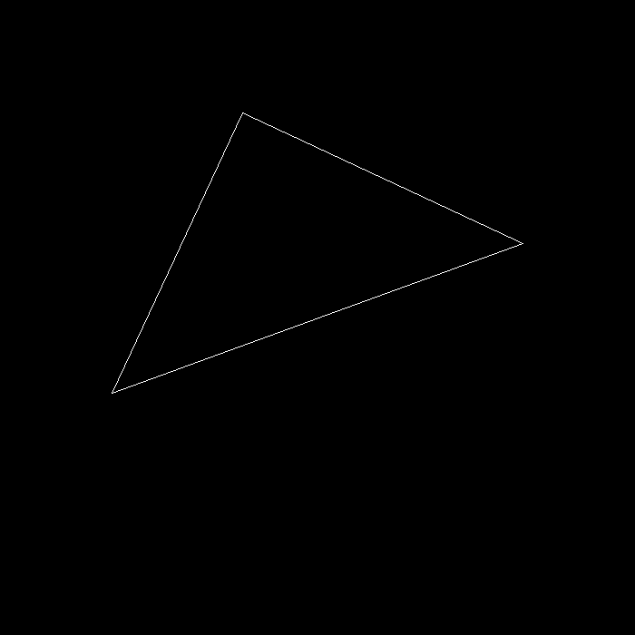

# Assignment 1: Rotation and Projection

* `get_model_matrix(float rotation_angle)` in `main.cpp`: 

  Create the model matrix by rotating given triangle around the **Z** axis.

* `get_projection_matrix(float eye_fov, float aspect_ratio, float z_near, float z_far)` in `main.cpp` :

  Create the projection matrix with the given parameters.


To enable rotation around **arbitrary axis that passes the origin**, uncomment the definition of macro `ARBITRARY_AXIS` in `main.cpp`, and change the valuable `axis`  to the axis you want.

* `get_rotation(Eigen::Vector3f axis, float rotation_angle)` in `main.cpp`:

  Create the matrix for rotating the triangle around any given axis that passes the origin.

  (using [Rodrigues’ rotation formula](https://en.wikipedia.org/wiki/Rodrigues%27_rotation_formula))


## Run

```
mkdir build
cd build
cmake ..

make
./Rasterizer		(real-time display, press A/D to rotate counter-clockwise/clockwise, ESC to exit)
./Rasterizer -r 20	(generate output.png, rotate counter-clockwise for 20 degrees)
./Rasterizer -r 20 image.png	(generate image.png, rotate counter-clockwise for 20 degrees)
```


## Image

A triangle rotate counter-clockwise around Z axis for 20 degrees. 

