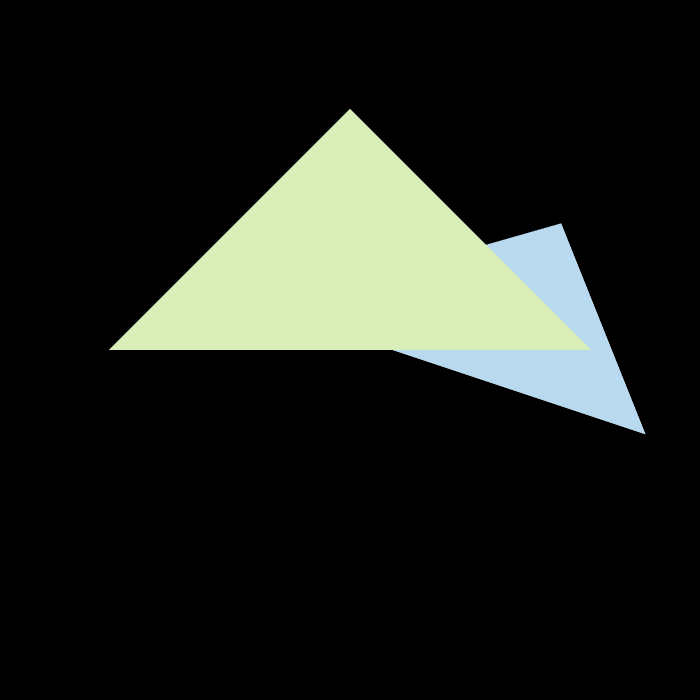
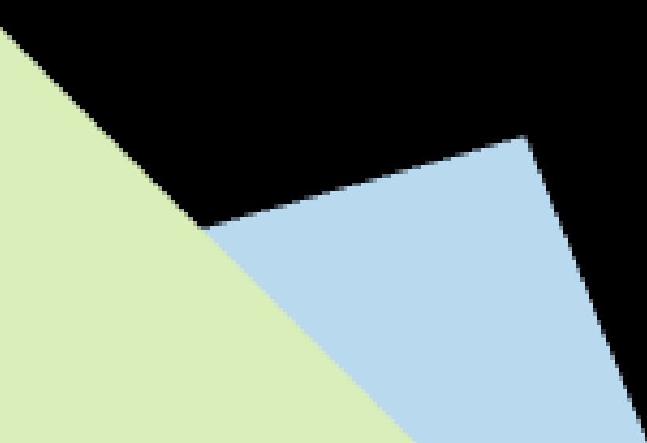

# Assignment 2: Triangles and Z-buffering

* `inside_triangle(float x, float y)` in `Triangle.cpp` :

  Check if the given point (x, y) is inside the triangle.
  
* `rasterize_triangle(const Triangle& t)` in `Rasterizer.cpp`: 

  Do screen space rasterization for the given triangle.


To enable **4x SSAA** (Super sampling anti-aliasing), uncomment the definition of macro `ANTI_ALIASING` in `main.cpp`.


## Run

Modify the path in `CMakeLists.txt`, then

```shell
mkdir build
cd build
cmake ..

make
./Rasterizer		(real-time display)
./Rasterizer image.png	(generate the result to image.png)
```


## Image

| Scene Name | Two Triangles(No anti-aliasing)                              | Two Triangles(4x SSAA)                                       |
| ---------- | ------------------------------------------------------------ | ------------------------------------------------------------ |
| Overview   |  |  |
| Detail     |  |  |