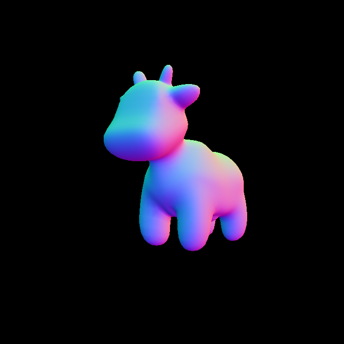
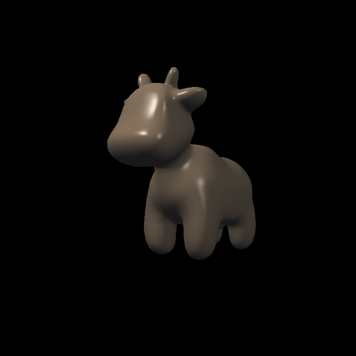
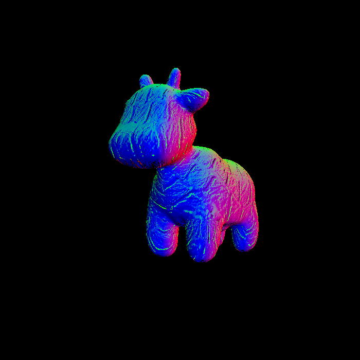
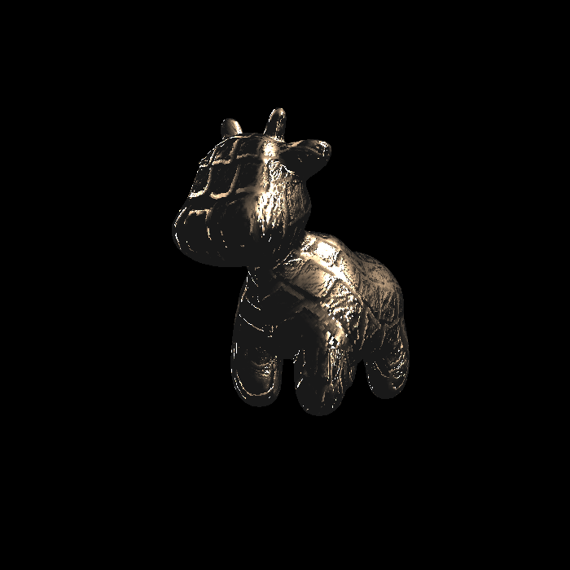
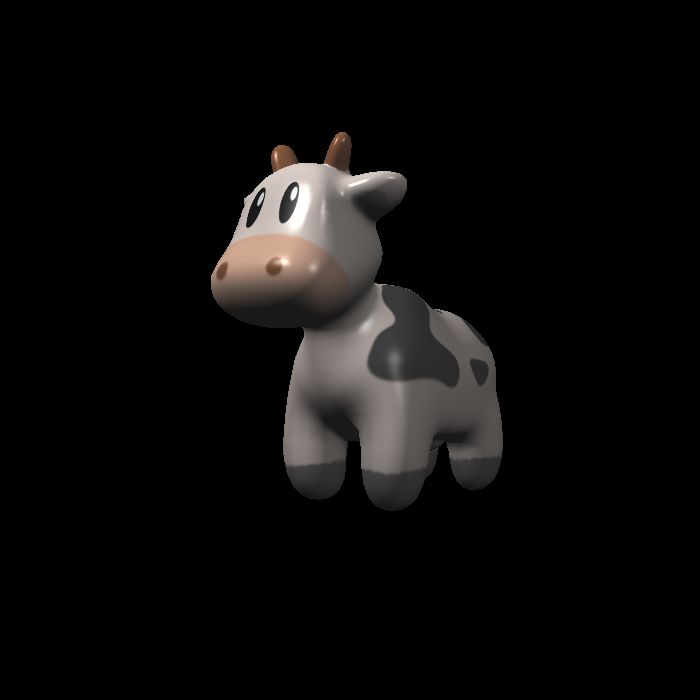
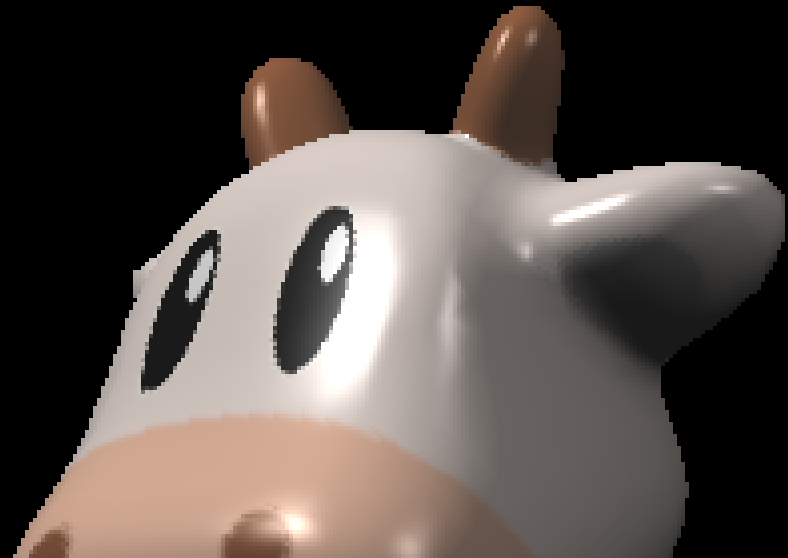
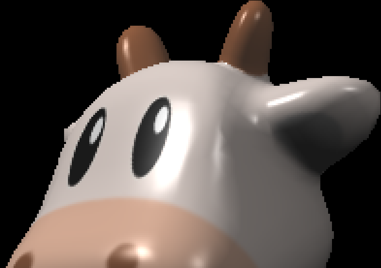

# Assignment 3: Pipeline and Shading

* `normal_fragment_shader` in `main.cpp` :

  Implement surface normal visualization.
  
* `phong_fragment_shader` in `main.cpp` :

  Implement Blinn-Phong lighting model.
  
* `texture_fragment_shader` in `main.cpp` :

  Implement texture based on Blinn-Phong lighting model.
  
* `bump_fragment_shader` in `main.cpp` :

  Implement bump mapping based on Blinn-Phong lighting model.

* `displacement_fragment_shader` in `main.cpp` :

  Implement displacement mapping based on Blinn-Phong lighting model.


To enable texture sampling with **bilinear interpolation**, uncomment the definition of macro `BILINEAR` in `main.cpp`.


## Run

Modify the path in `CMakeLists.txt`, then

```shell
mkdir build
cd build
cmake ..

make
./Rasterizer	(real-time display, default to normal visualizing, press A/D to rotate the model around axis-Y)
./Rasterizer image.png normal	(generate the result of normal visualizing to image.png)
./Rasterizer image.png phong	(generate the result of Blinn-Phong shading to image.png)
./Rasterizer image.png texture	(generate the result of texture mapping to image.png)
./Rasterizer image.png bump	(generate the result of bump mapping to image.png)
./Rasterizer image.png displacement	(generate the result of displacement mapping to image.png)
```


## Image

| Shading Model              | Image                                                 |
| -------------------------- | ----------------------------------------------------- |
| Surface Normal Visualizing |              |
| Blinn-Phong Shading        |    |
| Texture Mapping            |            |
| Bump Mapping               |                  |
| Displacement Mapping       |  |


| Texture Sampling Method | Default                                                   | Bilinear Interpolation                                       |
| ----------------------- | --------------------------------------------------------- | ------------------------------------------------------------ |
| Overview                |                |  |
| Detail                  |  |  |

