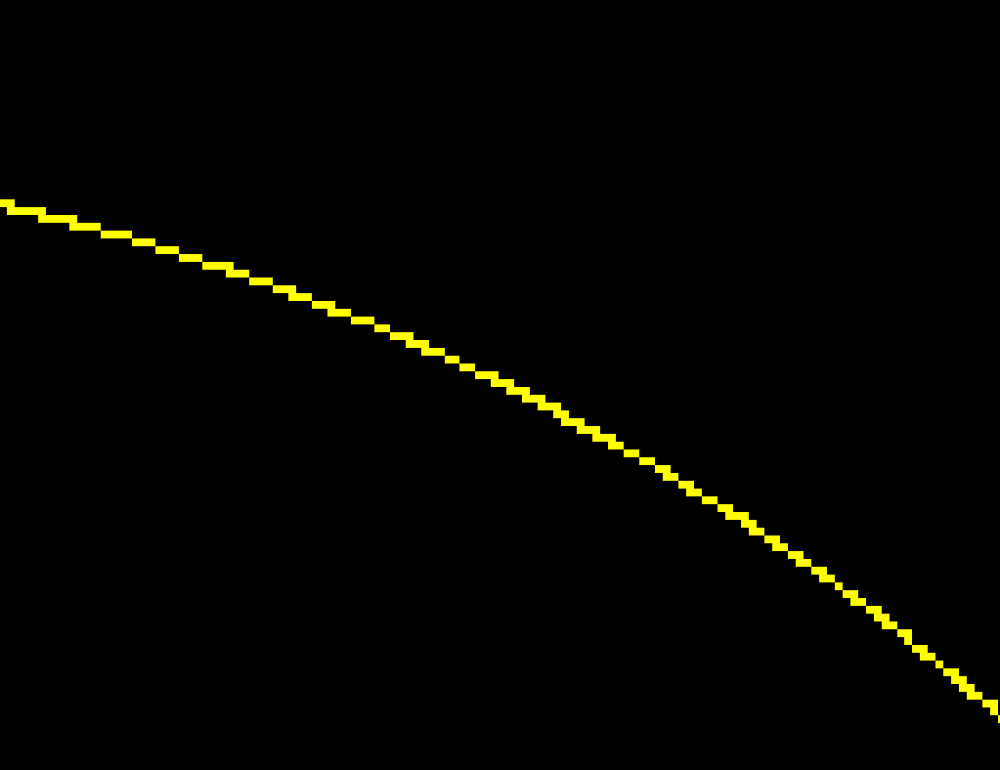
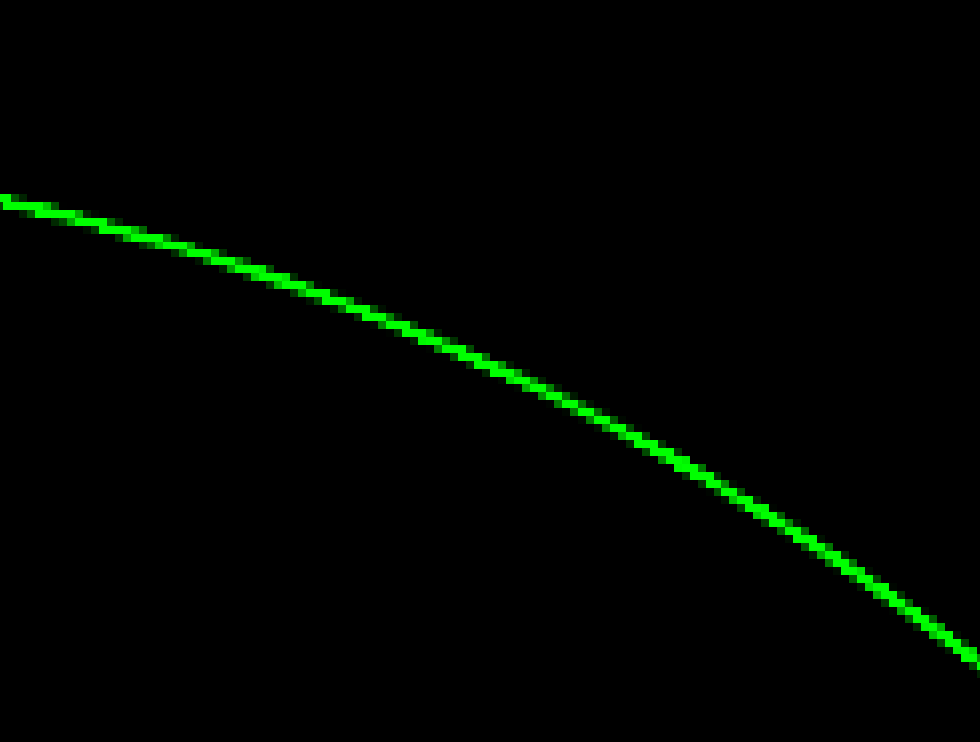

# Assignment 4: Bézier Curve

* `naive_bezier` in `main.cpp` :

  Use cubic formula to generate Bézier Curve with 4 control points. 
  
* `recursive_bezier` in `main.cpp` :

  Use de Casteljau's algorithm to generate Bézier Curve.
  
* `bezier` in `main.cpp` :

  Iterate through all t = 0 to t = 1 with small steps, and call de Casteljau's recursive Bezier algorithm to generate curve.


The default setting implement naive bezier curve generation (red) and recursive bezier curve generation (green) at the same time. Therefore the pure yellow result proves that these two implementations generate the same result. 


To enable anti-aliasing, uncomment the definition of macro `ANTI_ALIASING` in `main.cpp`.


## Run

Modify the path in `CMakeLists.txt`

```
mkdir build
cd build
cmake ..

make
./Rasterizer	(real-time display, accept at most 4 control points through mouse-click and generate a Bézier curve. Also save the result image in to file my_bezier_curve.png)
```


## Image


| Texture Sampling Method | Default                                                      | Bilinear Interpolation                                       |
| ----------------------- | ------------------------------------------------------------ | ------------------------------------------------------------ |
| Overview                |  |  |
| Detail                  |  |  |

