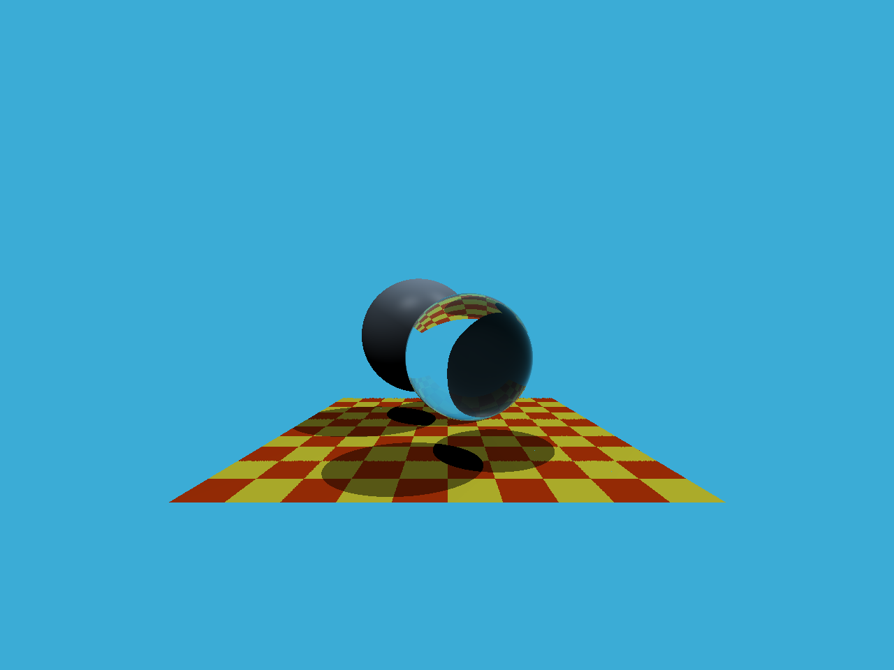

# Assignment 5: Ray and Triangle Intersection

Implement **Whitted-Style** ray tracing.


* `render` in `Renderer.cpp` :

  Create a ray for each pixel and use `cast_ray` to get its color.
  
* `ray_triangle_intersect` in `Triangle.cpp` :

  Use **Moller-Trumbore** algorithm to test whether the triangle intersects with the ray.


## Run

Modify the path in `CMakeLists.txt`

```
mkdir build
cd build
cmake ..

make
./RayTracing	(save the result image in to file output.png)
```


## Image

A scene with diffuse sphere, glass sphere and a gird with checkerboard-style texture.

