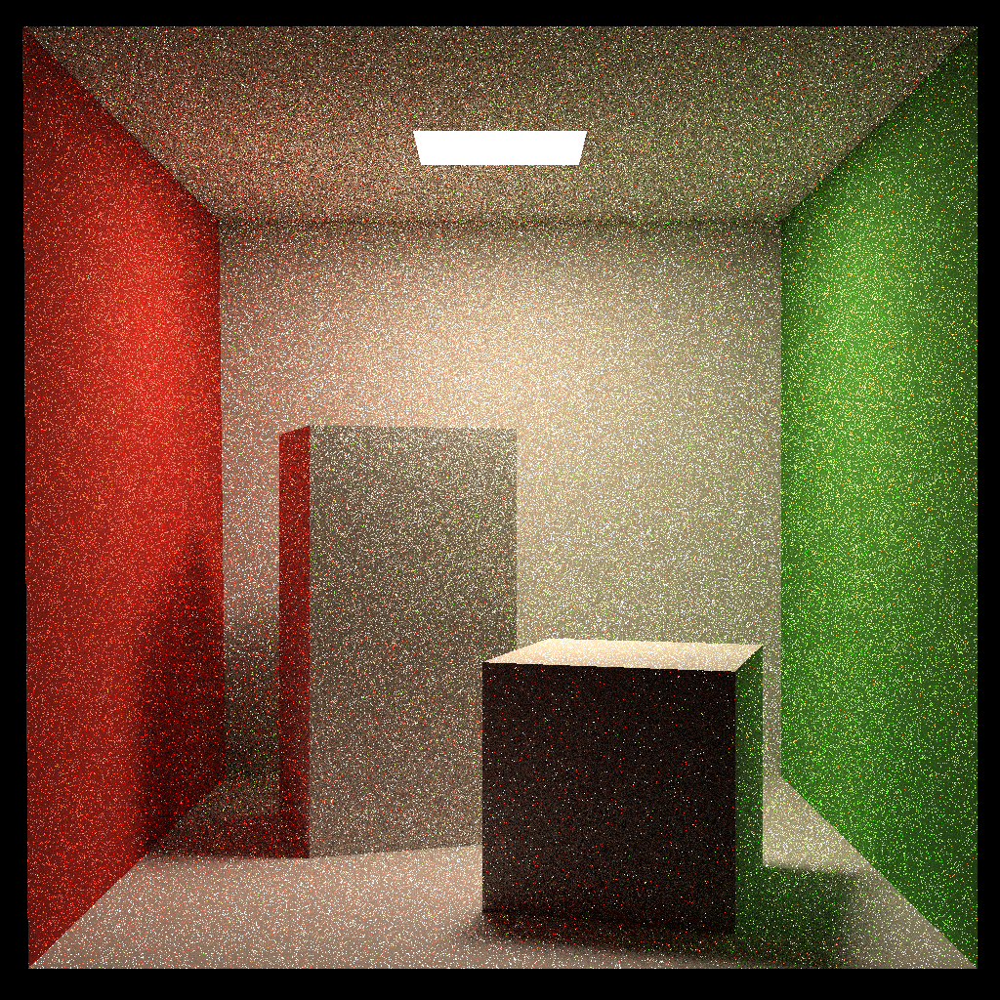

# Assignment 7: Path Tracing

Implement **Path Tracing** with **Bidirectional Reflectance Distribution Function (BRDF)**.


// todo

* Implement higher spp with multi-thread acceleration.

* Implement microfacet model for **Bidirectional Scattering Distribution Function (BSDF)** and **multiple importance sampling**.

* Implement **Bi-directional Path Tracing (BDPT)**


## Run

Modify the path in `CMakeLists.txt`

```
mkdir build
cd build
cmake ..

make
./RayTracing	(save the result image in to file output.png)
```


## Image

Cornellbox scene with only basic diffuse material and global illumination (16 spp).


