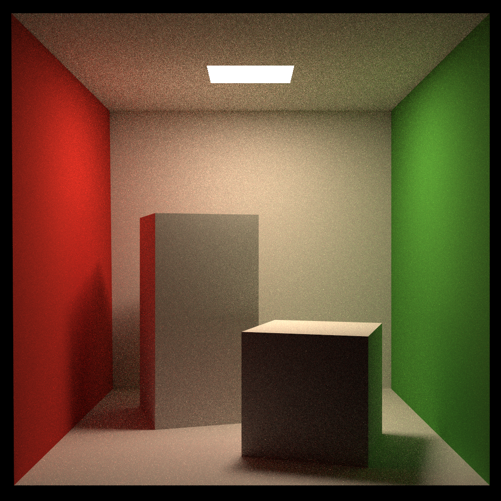
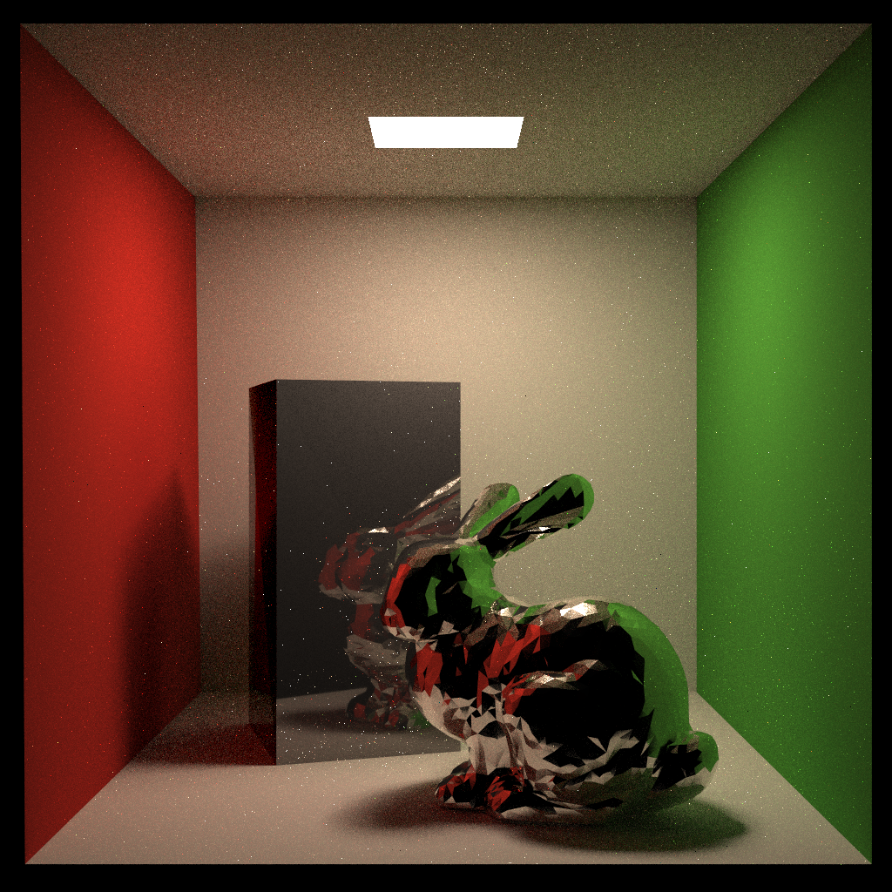
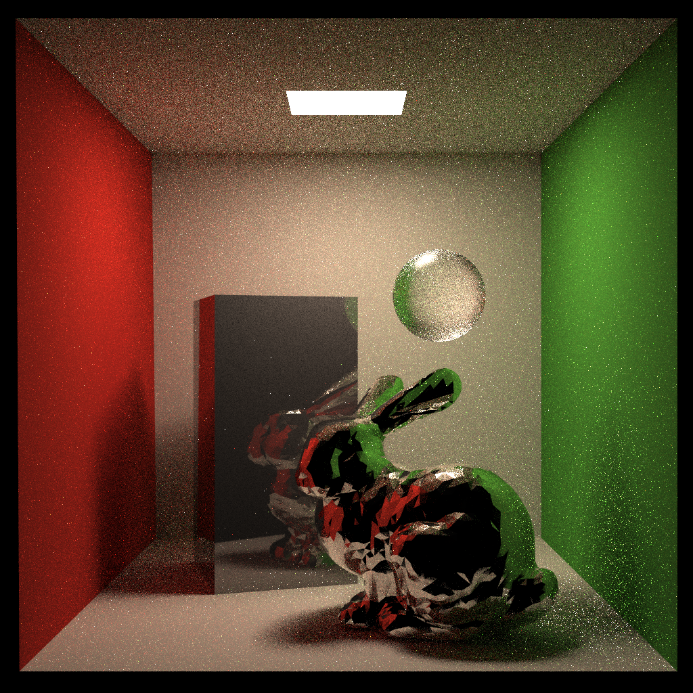

# Assignment 7: Path Tracing

* **Path Tracing** with **Bidirectional Scattering Distribution Function (BSDF)**.
  * Diffuse : Lambert
  * Specular : Cook–Torrance
    * D : Generalized-Trowbridge-Reitz (GTR) when γ = 2
    * F : Fresnel-Schlick approximation
    * G : Smith-Joint Approximation

* **Materials**
  * Diffuse
  * Metal-roughness workflow
* Frosted glass
  
* **Multiple Importance Sampling** for *direct* light illumination.

* **Anti-aliasing** and **multi-threading acceleration**.


// todo

* Bi-directional Path Tracing (BDPT)


## Run

Modify the path in `CMakeLists.txt`, then

```shell
mkdir build
cd build
cmake ..

make
./RayTracing	(save the result image in to file output.png)
```


## Image

| Scene                                                    | PT 16 spp                                             | PT 64 spp                                             |
| -------------------------------------------------------- | ----------------------------------------------------- | ----------------------------------------------------- |
| Diffuse material                                         |              |              |
| Metal-Roughness workflow (marble box, silver bunny)      |      |      |
| Transmission through rough surfaces (frosted glass ball) |  |  |


## Extra References

* [Multiple Importance Sampling](https://graphics.stanford.edu/courses/cs348b-03/papers/veach-chapter9.pdf)
* [Microfacet Models for Refraction through Rough Surfaces](https://www.cs.cornell.edu/~srm/publications/EGSR07-btdf.pdf)

* [Understanding the Masking-Shadowing Function in Microfacet-Based BRDFs](http://jcgt.org/published/0003/02/03/paper.pdf)
  * [Respawn Entertainment Smith-Joint Approximation](https://twvideo01.ubm-us.net/o1/vault/gdc2017/Presentations/Hammon_Earl_PBR_Diffuse_Lighting.pdf)

