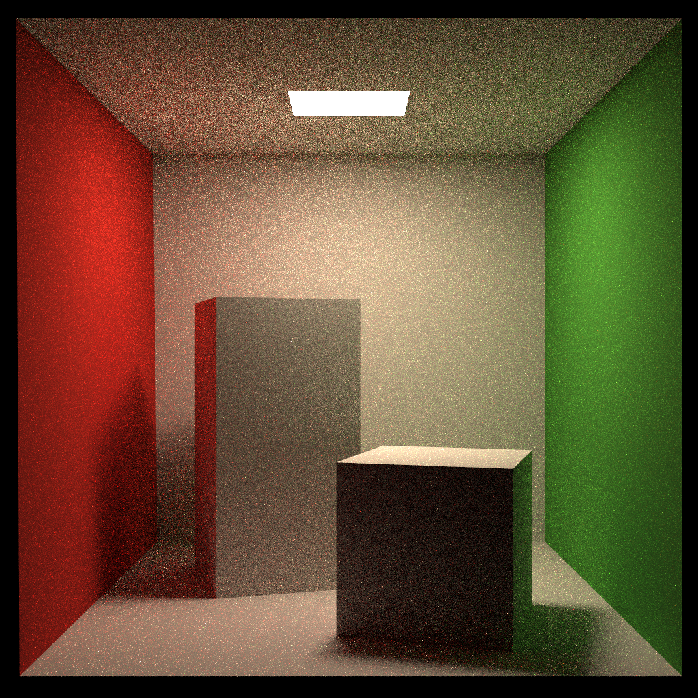

# Assignment 7: Path Tracing

Implement **Path Tracing** with **Bidirectional Reflectance Distribution Function (BRDF)**.

Implement multiple sample points and multi-thread acceleration.


// todo

* Implement microfacet model for **Bidirectional Scattering Distribution Function (BSDF)** and **multiple importance sampling**.

* Implement **Bi-directional Path Tracing (BDPT)**


## Run

Modify the path in `CMakeLists.txt`

```
mkdir build
cd build
cmake ..

make
./RayTracing	(save the result image in to file output.png)
```


## Image

| Scene                                                        | BRDF 16 spp                       | BRDF 64 spp                       |
| ------------------------------------------------------------ | --------------------------------- | --------------------------------- |
| Cornellbox (basic diffuse material with global illumination) |  |  |