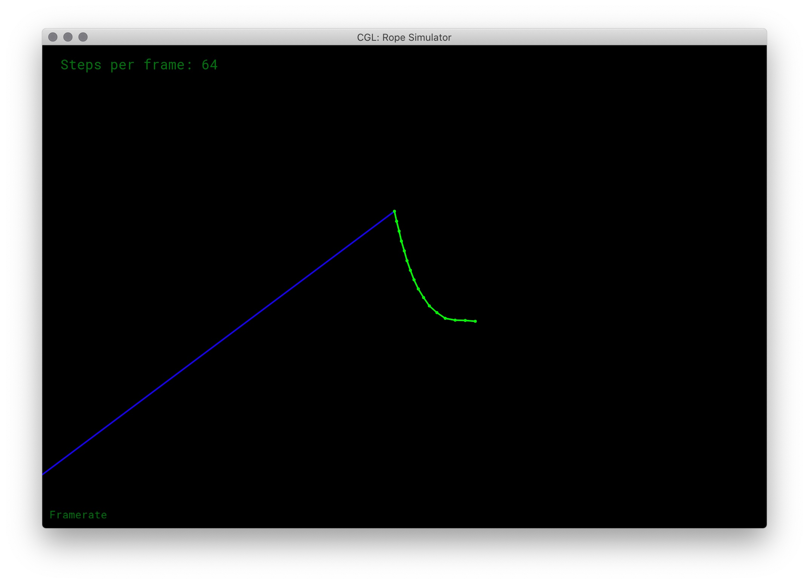
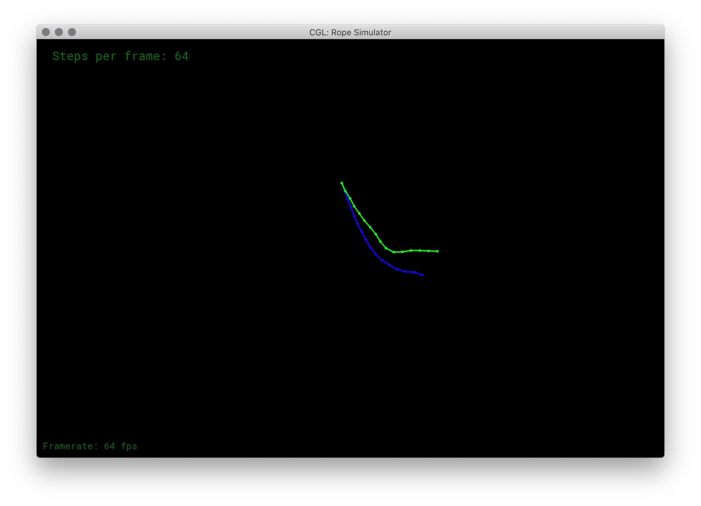
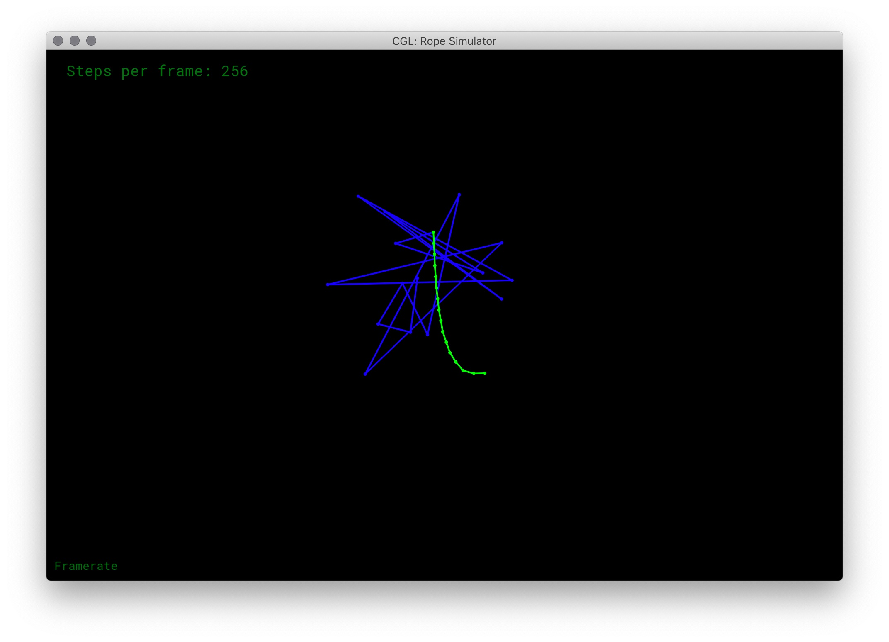
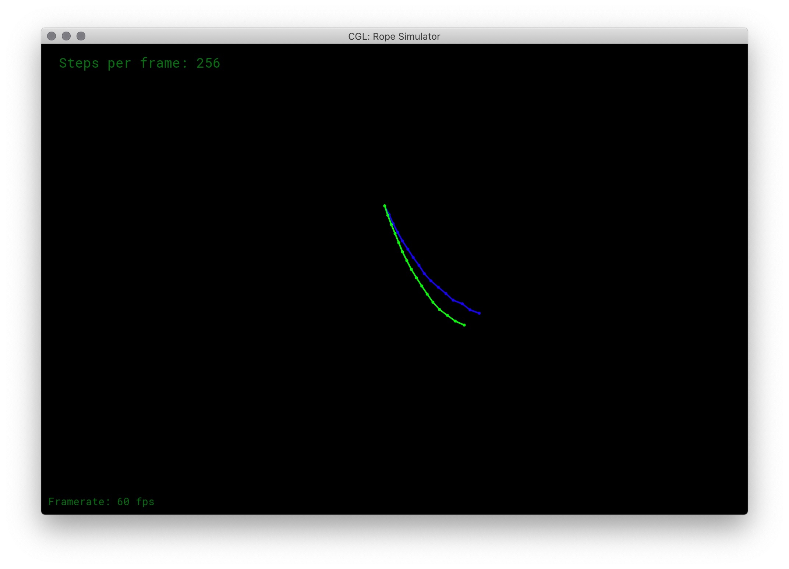
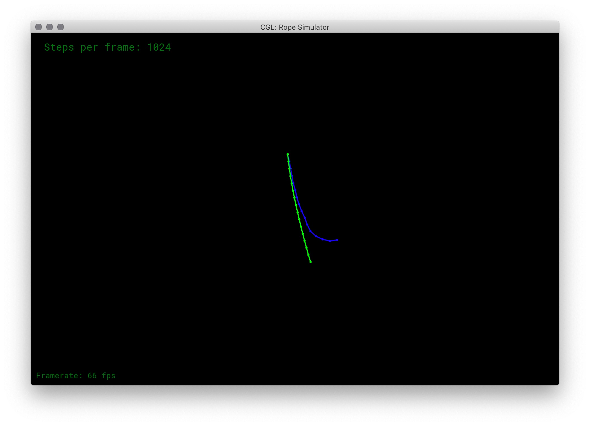
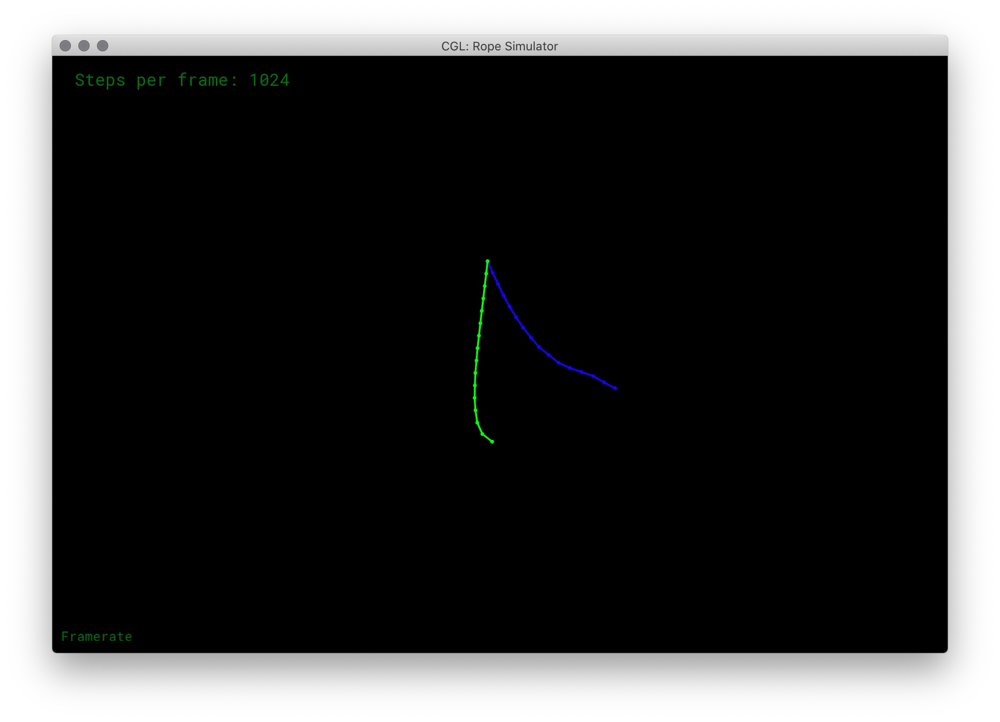

# Assignment 8: Rope Simulation

* **Spring-Mass System**
  * Euler method
    * Explicit Euler method
    * Semi-Implicit Euler method
  * Explicit Verlet method
* **Damping**
  * Global Damping force


To enable *Semi-Implicit Euler method* instead of *Explicit Euler method*, comment the definition of macro `EXPLICIT` in `src/rope.cpp`.


**Note:**

* Explicit euler method brings **instability** and needs **small time step** to perform well (increase steps per frame).
* Verlet method is **not** physically based, **dissipates energy**(error).

## Run

Before running, ensure the library `OpenGL`, `Freetype` and `RandR` have been installed

Then run the project with following commands:

```shell
mkdir build
cd build
cmake ..

make
./ropesim	# real-time display, the default number of steps per frame is 64
./ropesim -s 256 # change the number of steps per frame to 256
```


## Image

| Scene                | Explicit Euler & Explicit Verlet                             | Semi-Implicit Euler & Explicit Verlet                        |
| -------------------- | ------------------------------------------------------------ | ------------------------------------------------------------ |
| 64 steps per frame   |  |  |
| 256 steps per frame  |  |  |
| 1024 steps per frame |  |  |
