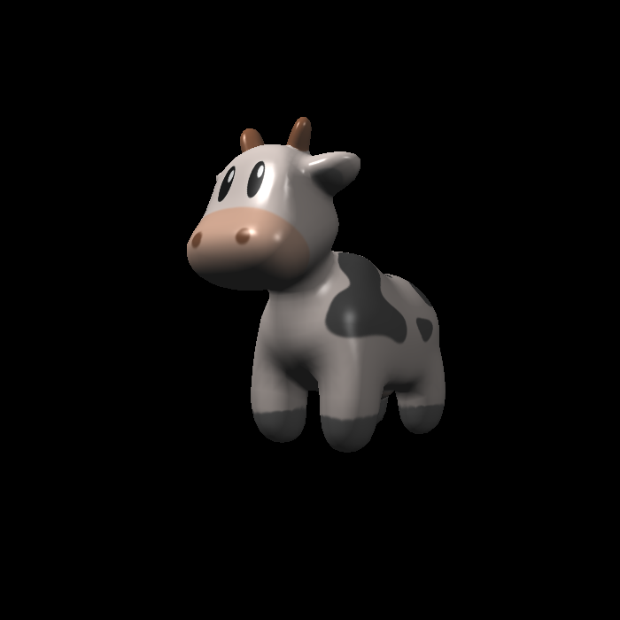
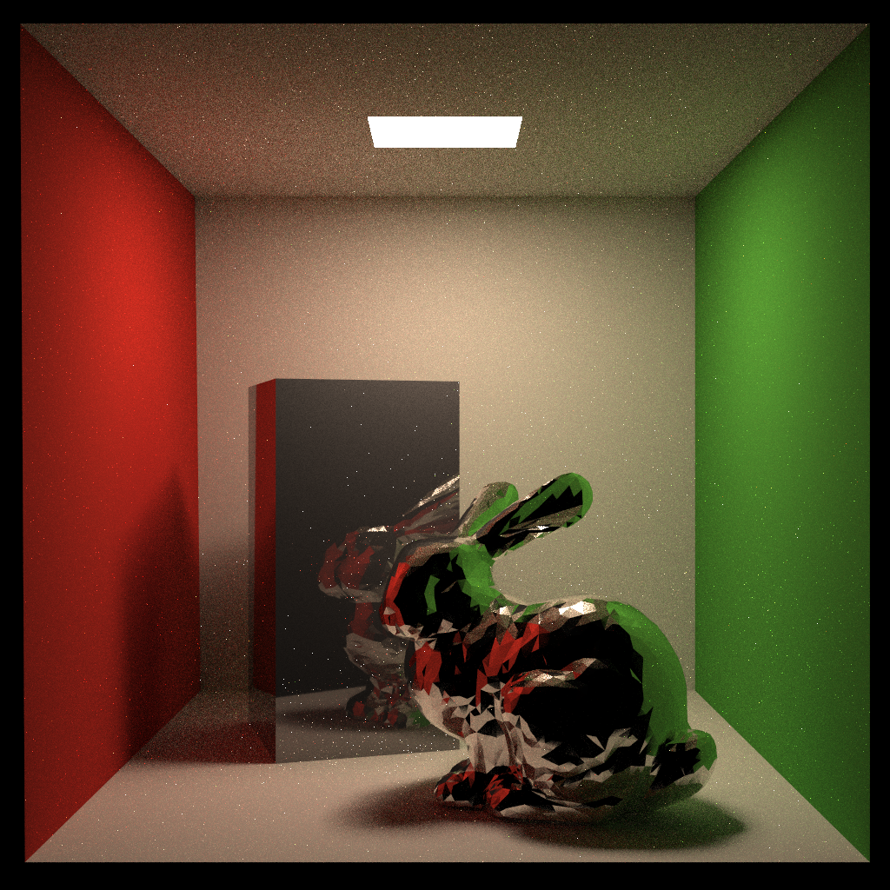

# GAMES101

This repo is based on the assignments of *Computer Graphics* course [GAMES101](https://sites.cs.ucsb.edu/~lingqi/teaching/games101.html) with *code refactoring* and *additional features*.

## Environment

* Language Standard: C++ 17
* Build: CMake
* Additional Libraries:
  * Eigen (linear algebra)
  * OpenCV, stb_image (image processing)
  * OBJ Loader (model loading)

## Gallery

Implement both rasterization and ray tracing.

### Rasterization

* Real-time displaying a textured cow with Blinn-Phong lighting model and bilinear interpolation texture sampling.

  

  

* Bézier Curve generation with anti-aliasing.

  

### Ray Tracing

* Whitted-Style ray tracing (Blinn-Phong lighting model with shadow effects and different materials).

  

  

* Bounding Volume Hierarchy (implement naive BVH and BVH with SAH partition)

  

  

* Path Tracing (BRDF, multiple importance sampling, anti-aliasing)

  

* // todo